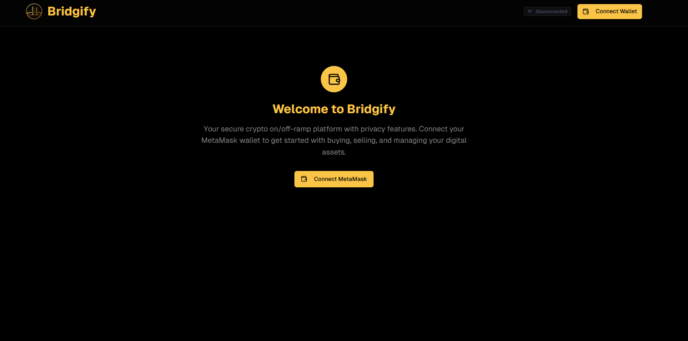
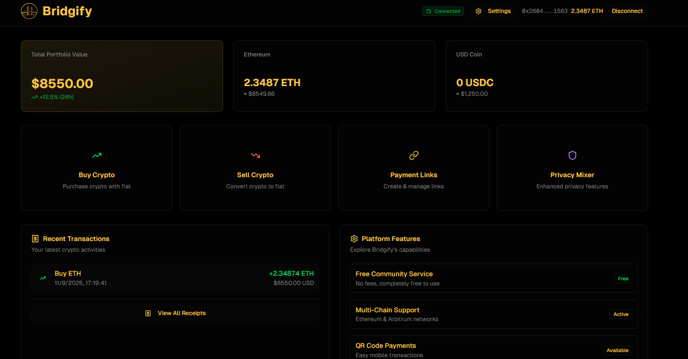

# Bridgify 

> **Project Status**: Under Development (MVP)  
> **Hackathon**: El Aleph 2025  

## 🚀 Overview

Bridgify is an innovative blockchain solution that seamlessly connects on-chain and off-chain transactions, providing users with a comprehensive suite of financial tools. Born during the El Aleph 2025 hackathon, Bridgify aims to simplify cryptocurrency transactions while maintaining privacy and security.

## ✨ Key Features

- **On-Chain/Off-Chain Swaps**
  - Seamlessly convert between different cryptocurrencies
  - Support for multiple blockchain networks
  - Competitive exchange rates with minimal slippage

- **Privacy-Focused Mixer**
  - Enhanced transaction privacy
  - Secure and untraceable transfers
  - Multiple mixing options for different privacy needs

- **Payment Links**
  - Generate shareable payment links in seconds
  - Customizable payment amounts and memos
  - Track payment status in real-time

- **QR Code Payments**
  - Generate QR codes for easy payments
  - Support for fixed and dynamic payment amounts
  - Mobile-friendly interface for on-the-go transactions

## 🖥️ Screenshots

### Home Page

### Dashboard

## 🛠️ Tech Stack

- **Frontend**: Next.js, TypeScript, Tailwind CSS
- **Smart Contracts**: Solidity, Hardhat
- **Blockchain**: Ethereum, Polygon (Other EVM-compatible chains in development)
- **Storage**: IPFS, Filecoin
- **Authentication**: Web3.js, Ethers.js

## 🚧 Project Status

Bridgify is currently in active development. While we're excited to share our progress, please note that this is an early version with ongoing improvements and new features being added regularly.

## 🤝 Contributing

We welcome contributions! If you'd like to contribute to Bridgify, please feel free to fork the repository and submit a pull request.

## 📄 License

This project is licensed under the MIT License.

---

*Bridgify - Bridging the gap between on-chain and off-chain transactions. Built with ❤️ during El Aleph 2025.*
